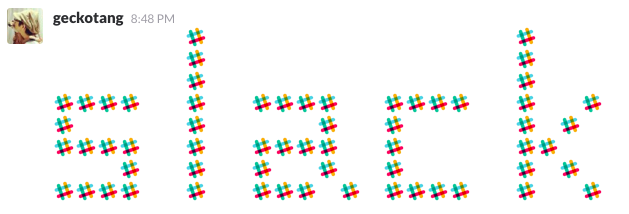

# Slack blank icon



Slack blank icon helps you create ASCII art using a emoji on slack.

## Instration

You can add blank icon in https://****.slack.com/customize/emoji (need permission).

### Import by script

Import script was created by [oti/slack-reaction-decomoji](https://github.com/oti/slack-reaction-decomoji).

```sh
$ git clone git@github.com:geckotang/slack-blank-icon.git
$ cd slack-blank-icon
$ bundle install
$ bundle exec ruby import.rb
```

### Usage

You type this code on your slack.

```
:blank::blank::blank::blank::blank::blank::slack::blank::blank::blank::blank::blank::blank::blank::blank::blank::blank::blank::blank::blank::blank::slack:
:blank::blank::blank::blank::blank::blank::slack::blank::blank::blank::blank::blank::blank::blank::blank::blank::blank::blank::blank::blank::blank::slack:
:blank::blank::blank::blank::blank::blank::slack::blank::blank::blank::blank::blank::blank::blank::blank::blank::blank::blank::blank::blank::blank::slack:
:slack::slack::slack::slack::blank::blank::slack::blank::blank::slack::slack::slack::slack::blank::blank::slack::slack::slack::slack::blank::blank::slack::blank::blank::slack:
:slack::blank::blank::blank::blank::blank::slack::blank::blank::blank::blank::blank::slack::blank::blank::slack::blank::blank::blank::blank::blank::slack::blank::slack:
:slack::slack::slack::slack::blank::blank::slack::blank::blank::slack::slack::slack::slack::blank::blank::slack::blank::blank::blank::blank::blank::slack::slack:
:blank::blank::blank::slack::blank::blank::slack::blank::blank::slack::blank::blank::slack::blank::blank::slack::blank::blank::blank::blank::blank::slack::blank::slack:
:slack::slack::slack::slack::blank::blank::slack::blank::blank::slack::slack::slack::blank::slack::blank::slack::slack::slack::slack::blank::blank::slack::blank::blank::slack:
```

And then, see below:


## LICENSE

CC BY-NC
